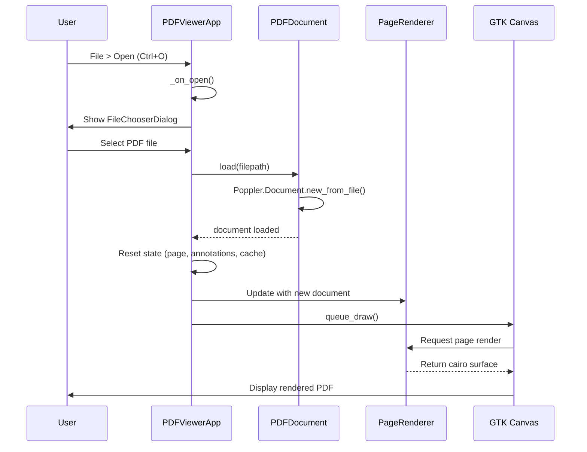
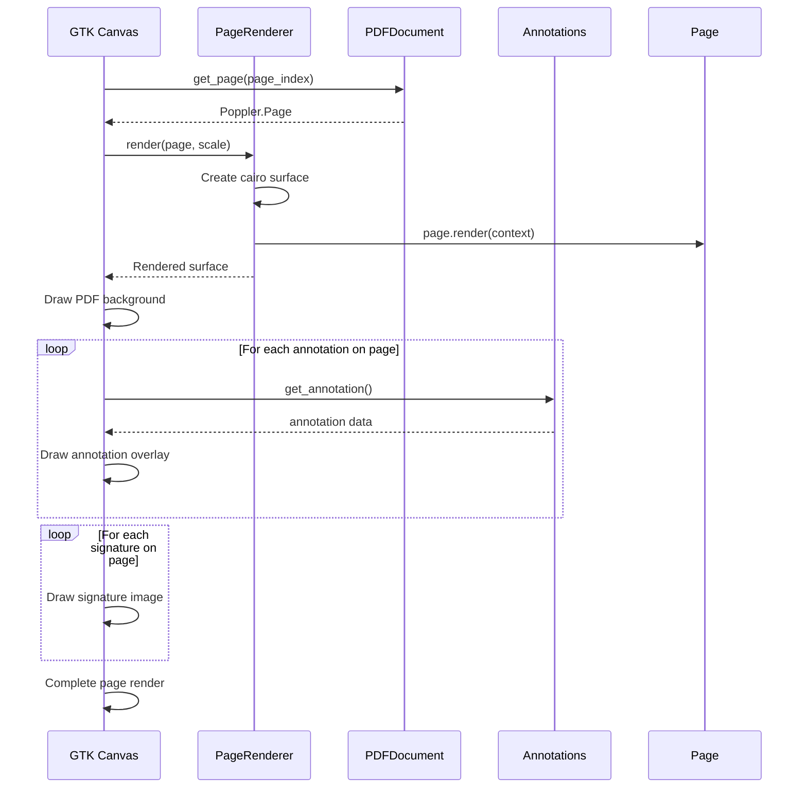
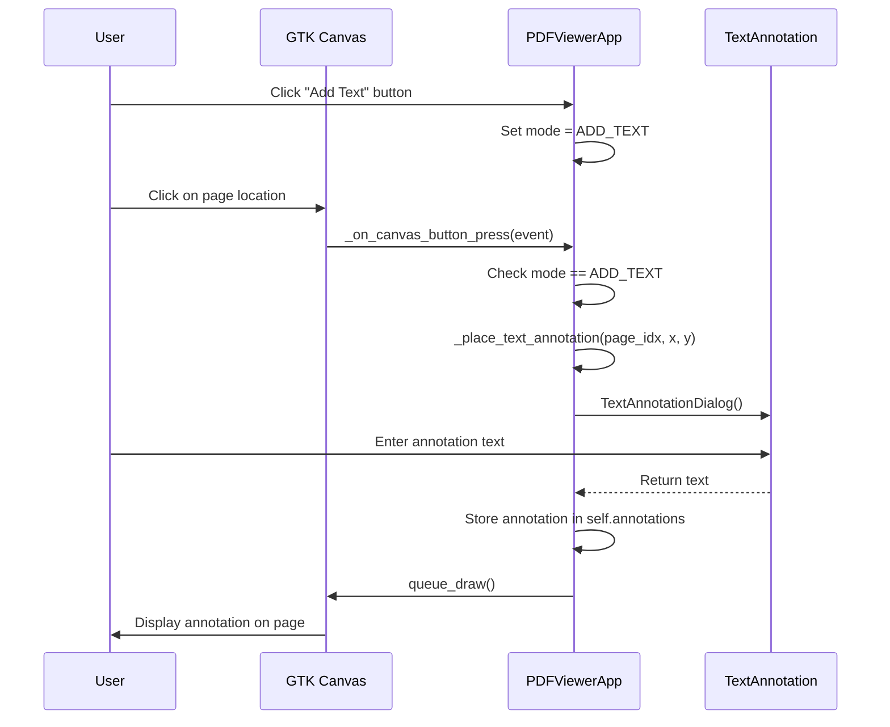
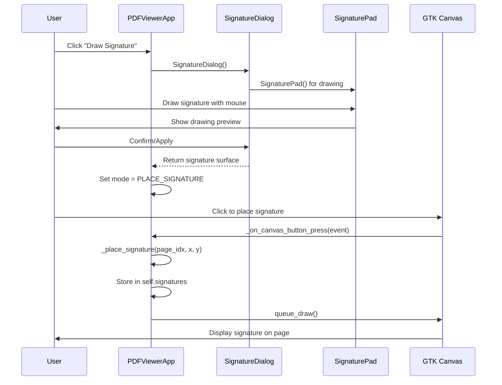
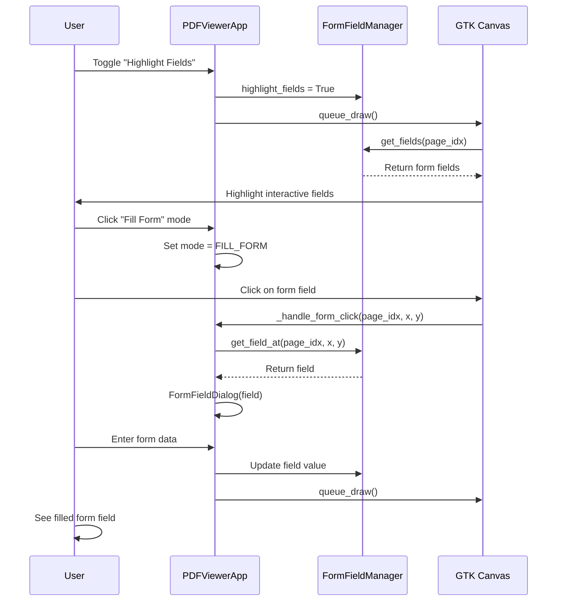

# madOS PDF Viewer

A professional PDF viewing application for madOS (Arch Linux) featuring PDF rendering via Poppler, text annotations, digital signatures, form filling, save/print functionality, and Nord theme styling.

## Features

- **PDF Rendering**: High-quality PDF display using Poppler/Cairo
- **Text Annotations**: Add, move, and clear text annotations on any page
- **Digital Signatures**: Draw signatures or place image signatures on documents
- **Form Fields**: Fill interactive PDF forms
- **Save & Print**: Save annotated PDFs and print documents
- **Navigation**: Page navigation, zoom controls, fit-to-width/page modes
- **Keyboard Shortcuts**: Arrow keys (navigate), +/- (zoom), Ctrl+O (open), Ctrl+S (save)
- **Nord Theme**: Beautiful dark theme following the Nord color palette

## Requirements

- Python 3
- GTK3 (gir1.2-gtk-3.0)
- Poppler (gir1.2-poppler-0.18)
- Cairo (python-cairo)

## Installation

```bash
# Run with Python module
python -m mados_pdf_viewer

# Or run directly
python __main__.py

# With a PDF file
python -m mados_pdf_viewer document.pdf
```

## Architecture

### Frontend (GTK3 UI)

```
+---------------------------------------------------------------+
|                      PDFViewerApp                             |
|  +-------------+  +-------------+  +--------------------+   |
|  |   Toolbar   |  |   Canvas    |  |    Statusbar       |   |
|  | (buttons,   |  | (PDF render |  | (page info, zoom)  |   |
|  |  controls)  |  |  + overlays)|  |                    |   |
|  +-------------+  +-------------+  +--------------------+   |
+---------------------------------------------------------------+
```

### Backend (Core Modules)

```
+---------------------------------------------------------------+
|  renderer.py - Poppler/Cairo Engine                          |
|  +---------------------------------------------------------+  |
|  | PDFDocument: load, get_page, metadata                  |  |
|  | PageRenderer: render page to cairo surface             |  |
|  +---------------------------------------------------------+  |
+----------------------------+----------------------------------+
                             |
                             v
+---------------------------------------------------------------+
|  annotations.py - Annotation Management                       |
|  +---------------------------------------------------------+  |
|  | TextAnnotation: position, text, color                   |  |
|  | SignaturePlacement: position, image surface             |  |
|  | SignaturePad/SignatureDialog: draw capture               |  |
|  | FormFieldManager: PDF form field handling              |  |
|  +---------------------------------------------------------+  |
+----------------------------+----------------------------------+
                             |
                             v
+---------------------------------------------------------------+
|  theme.py - Nord CSS Theme                                   |
|  +---------------------------------------------------------+  |
|  | apply_theme(): load Nord-themed CSS                     |  |
|  +---------------------------------------------------------+  |
+----------------------------+----------------------------------+
                             |
                             v
+---------------------------------------------------------------+
|  translations.py - i18n Support                              |
|  +---------------------------------------------------------+  |
|  | get_text(): retrieve translated strings                 |  |
|  | detect_system_language(): auto-detect locale            |  |
|  +---------------------------------------------------------+  |
+---------------------------------------------------------------+
```

## Sequence Diagrams

### Open PDF File



### Render Page with Annotations



### Add Text Annotation



### Add Digital Signature



### Fill PDF Form



## File Structure

```
mados-pdf-viewer/
├── AGENTS.md           # Agent guidelines
├── .gitignore          # Git ignore rules
├── __init__.py         # Package metadata
├── __main__.py         # Entry point
├── app.py              # Main window (GTK), toolbar, canvas
├── renderer.py         # Poppler/Cairo PDF rendering
├── annotations.py     # Text annotations, signatures, form fields
├── theme.py            # Nord CSS theme
└── translations.py     # i18n strings
```

## Interaction Modes

The application uses an `InteractionMode` enum to manage different user interaction states:

```python
class InteractionMode:
    NORMAL = "normal"           # Default viewing mode
    ADD_TEXT = "add_text"      # Adding text annotations
    PLACE_SIGNATURE = "place_signature"  # Placing signatures
    FILL_FORM = "fill_form"    # Filling PDF forms
```

## Keyboard Shortcuts

| Shortcut | Action |
|----------|--------|
| Arrow Left/Right | Previous/Next page |
| Arrow Up/Down | Previous/Next page |
| + / - | Zoom In/Out |
| Ctrl+O | Open file |
| Ctrl+S | Save |
| Ctrl+Shift+S | Save As |
| Ctrl+P | Print |
| Home | First page |
| End | Last page |

## License

MIT License